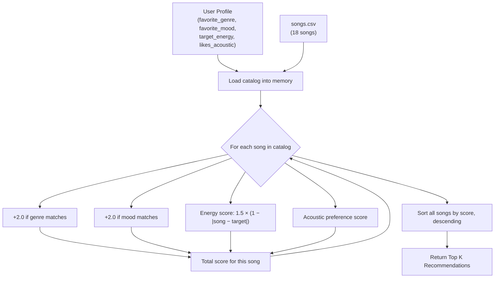

# 🎵 Music Recommender Simulation

## Project Summary

In this project you will build and explain a small music recommender system.

Your goal is to:

- Represent songs and a user "taste profile" as data
- Design a scoring rule that turns that data into recommendations
- Evaluate what your system gets right and wrong
- Reflect on how this mirrors real world AI recommenders

VibeFinder 1.0 is a content-based music recommender that scores every song in a catalog against a user's taste profile and returns the top matches. It uses genre, mood, energy, and acoustic texture to make recommendations, and explains why each song was chosen.

---

## How The System Works

### Song Features

Each song in `data/songs.csv` has these attributes:

| Feature | Type | Description |
|---|---|---|
| `genre` | categorical | e.g. pop, lofi, hip-hop, classical |
| `mood` | categorical | e.g. happy, chill, intense, relaxed |
| `energy` | 0.0–1.0 | How energetic the track feels |
| `tempo_bpm` | numeric | Beats per minute |
| `valence` | 0.0–1.0 | Musical positivity |
| `danceability` | 0.0–1.0 | How suitable for dancing |
| `acousticness` | 0.0–1.0 | How acoustic vs. electronic the track is |

### User Profile

The `UserProfile` stores four preferences:

- `favorite_genre` — the genre the user most wants to hear
- `favorite_mood` — the mood the user is targeting
- `target_energy` — ideal energy level (0.0–1.0)
- `likes_acoustic` — `True` if the user prefers acoustic, `False` for electronic/produced

### Algorithm Recipe (Scoring)

Every song gets a score computed as:

| Rule | Points |
|---|---|
| Genre match | **+2.0** |
| Mood match | **+2.0** |
| Energy closeness | **1.5 × (1 − \|song_energy − target_energy\|)** |
| Acoustic match | **+acousticness** if `likes_acoustic`, else **+(1 − acousticness)** |

Higher score = better match. Songs are sorted descending and the top `k` are returned.

### Data Flow



### Potential Biases

- **Genre over-weighting**: Genre and mood each give +2 pts — a song can score 4 pts before energy or acoustics are even considered. A great track in the wrong genre gets buried.
- **Small catalog effects**: With only 18 songs, some genres have 1–2 representatives, so a hip-hop fan always sees the same results.
- **No diversity enforcement**: The top 5 could all be the same genre or artist with no mechanism to spread results.

---

## Getting Started

### Setup

1. Create a virtual environment (optional but recommended):

   ```bash
   python -m venv .venv
   source .venv/bin/activate      # Mac or Linux
   .venv\Scripts\activate         # Windows

2. Install dependencies

```bash
pip install -r requirements.txt
```

3. Run the app:

```bash
python -m src.main
```

### Running Tests

Run the starter tests with:

```bash
pytest
```

You can add more tests in `tests/test_recommender.py`.

---

## Terminal Output — Profile Evaluations

Five user profiles were run against the 18-song catalog. Results below are actual terminal output.

### Profile 1 — High-Energy Pop

```
==================================================
Profile: High-Energy Pop
  genre=pop, mood=happy, energy=0.9, acoustic=False
==================================================
1. Sunrise City by Neon Echo  |  Score: 6.20
   • genre match (+2.0)
   • mood match (+2.0)
   • energy alignment (+1.38)
   • electronic preference (+0.82)

2. Gym Hero by Max Pulse  |  Score: 4.41
   • genre match (+2.0)
   • energy alignment (+1.46)
   • electronic preference (+0.95)

3. Neon Seoul by PRISM  |  Score: 4.37
   • mood match (+2.0)
   • energy alignment (+1.46)
   • electronic preference (+0.91)

4. Rooftop Lights by Indigo Parade  |  Score: 3.94
   • mood match (+2.0)
   • energy alignment (+1.29)
   • electronic preference (+0.65)

5. Backroad Summer by Clay Hollis  |  Score: 3.43
   • mood match (+2.0)
   • energy alignment (+1.11)
   • electronic preference (+0.32)
```

### Profile 2 — Chill Lofi

```
==================================================
Profile: Chill Lofi
  genre=lofi, mood=chill, energy=0.35, acoustic=True
==================================================
1. Library Rain by Paper Lanterns  |  Score: 6.36
   • genre match (+2.0)
   • mood match (+2.0)
   • energy alignment (+1.50)
   • acoustic preference (+0.86)

2. Midnight Coding by LoRoom  |  Score: 6.11
   • genre match (+2.0)
   • mood match (+2.0)
   • energy alignment (+1.40)
   • acoustic preference (+0.71)

3. Spacewalk Thoughts by Orbit Bloom  |  Score: 4.32
   • mood match (+2.0)
   • energy alignment (+1.40)
   • acoustic preference (+0.92)

4. Focus Flow by LoRoom  |  Score: 4.20
   • genre match (+2.0)
   • energy alignment (+1.42)
   • acoustic preference (+0.78)

5. Island Vibes by Coral Drift  |  Score: 3.86
   • mood match (+2.0)
   • energy alignment (+1.24)
   • acoustic preference (+0.62)
```

### Profile 3 — Deep Intense Rock

```
==================================================
Profile: Deep Intense Rock
  genre=rock, mood=intense, energy=0.95, acoustic=False
==================================================
1. Storm Runner by Voltline  |  Score: 6.34
   • genre match (+2.0)
   • mood match (+2.0)
   • energy alignment (+1.44)
   • electronic preference (+0.90)

2. Iron Throne by Vaultbreaker  |  Score: 4.43
   • mood match (+2.0)
   • energy alignment (+1.47)
   • electronic preference (+0.96)

3. Gym Hero by Max Pulse  |  Score: 4.42
   • mood match (+2.0)
   • energy alignment (+1.47)
   • electronic preference (+0.95)

4. Street Flex by K-Sway  |  Score: 4.33
   • mood match (+2.0)
   • energy alignment (+1.40)
   • electronic preference (+0.93)

5. Neon Seoul by PRISM  |  Score: 2.29
   • energy alignment (+1.38)
   • electronic preference (+0.91)
```

### Profile 4 — Contradictory Listener (edge case: high energy + moody)

```
==================================================
Profile: Contradictory Listener
  genre=synthwave, mood=moody, energy=0.9, acoustic=False
==================================================
1. Night Drive Loop by Neon Echo  |  Score: 6.05
   • genre match (+2.0)
   • mood match (+2.0)
   • energy alignment (+1.27)
   • electronic preference (+0.78)

2. Delta Rain Blues by Lowland Few  |  Score: 3.06
   • mood match (+2.0)
   • energy alignment (+0.87)
   • electronic preference (+0.19)

3. Gym Hero by Max Pulse  |  Score: 2.41
   • energy alignment (+1.46)
   • electronic preference (+0.95)

4. Street Flex by K-Sway  |  Score: 2.40
   • energy alignment (+1.47)
   • electronic preference (+0.93)

5. Storm Runner by Voltline  |  Score: 2.38
   • energy alignment (+1.48)
   • electronic preference (+0.90)
```

### Profile 5 — Reggaeton Fan (edge case: genre not in catalog)

```
==================================================
Profile: Reggaeton Fan
  genre=reggaeton, mood=happy, energy=0.85, acoustic=False
==================================================
1. Neon Seoul by PRISM  |  Score: 4.38
   • mood match (+2.0)
   • energy alignment (+1.47)
   • electronic preference (+0.91)

2. Sunrise City by Neon Echo  |  Score: 4.28
   • mood match (+2.0)
   • energy alignment (+1.46)
   • electronic preference (+0.82)

3. Rooftop Lights by Indigo Parade  |  Score: 4.01
   • mood match (+2.0)
   • energy alignment (+1.36)
   • electronic preference (+0.65)

4. Backroad Summer by Clay Hollis  |  Score: 3.51
   • mood match (+2.0)
   • energy alignment (+1.19)
   • electronic preference (+0.32)

5. Street Flex by K-Sway  |  Score: 2.39
   • energy alignment (+1.46)
   • electronic preference (+0.93)
```

---

## Experiments You Tried

### Weight Shift: Genre ÷2, Energy ×2

Changed scoring to: genre=+1.0, mood=+2.0, energy=3.0×(1−diff).

**What changed:** Rankings 2–5 shuffled noticeably. "Gym Hero" dropped from #2 to #4 for the High-Energy Pop profile because it has the wrong mood — energy alignment alone couldn't compensate. Songs with great energy fits but wrong genre moved up.

**What stayed the same:** The #1 song held position for all three profiles. Songs that matched genre + mood + energy were still clearly the best regardless of weights.

**Conclusion:** The original weights are reasonable. Doubling energy rewards "vibe accuracy" over "loyalty to a genre," which is more intuitive — but the catalog is too small for the difference to be dramatic.

---

## Limitations and Risks

Summarize some limitations of your recommender.

Examples:

- It only works on a tiny catalog
- It does not understand lyrics or language
- It might over favor one genre or mood

You will go deeper on this in your model card.

---

## Reflection

Read and complete `model_card.md`:

[**Model Card**](model_card.md)

Write 1 to 2 paragraphs here about what you learned:

- about how recommenders turn data into predictions
- about where bias or unfairness could show up in systems like this


---

## 7. `model_card_template.md`

Combines reflection and model card framing from the Module 3 guidance. :contentReference[oaicite:2]{index=2}  

```markdown
# 🎧 Model Card - Music Recommender Simulation

## 1. Model Name

Give your recommender a name, for example:

> VibeFinder 1.0

---

## 2. Intended Use

- What is this system trying to do
- Who is it for

Example:

> This model suggests 3 to 5 songs from a small catalog based on a user's preferred genre, mood, and energy level. It is for classroom exploration only, not for real users.

---

## 3. How It Works (Short Explanation)

Describe your scoring logic in plain language.

- What features of each song does it consider
- What information about the user does it use
- How does it turn those into a number

Try to avoid code in this section, treat it like an explanation to a non programmer.

---

## 4. Data

Describe your dataset.

- How many songs are in `data/songs.csv`
- Did you add or remove any songs
- What kinds of genres or moods are represented
- Whose taste does this data mostly reflect

---

## 5. Strengths

Where does your recommender work well

You can think about:
- Situations where the top results "felt right"
- Particular user profiles it served well
- Simplicity or transparency benefits

---

## 6. Limitations and Bias

Where does your recommender struggle

Some prompts:
- Does it ignore some genres or moods
- Does it treat all users as if they have the same taste shape
- Is it biased toward high energy or one genre by default
- How could this be unfair if used in a real product

---

## 7. Evaluation

How did you check your system

Examples:
- You tried multiple user profiles and wrote down whether the results matched your expectations
- You compared your simulation to what a real app like Spotify or YouTube tends to recommend
- You wrote tests for your scoring logic

You do not need a numeric metric, but if you used one, explain what it measures.

---

## 8. Future Work

If you had more time, how would you improve this recommender

Examples:

- Add support for multiple users and "group vibe" recommendations
- Balance diversity of songs instead of always picking the closest match
- Use more features, like tempo ranges or lyric themes

---

## 9. Personal Reflection

A few sentences about what you learned:

- What surprised you about how your system behaved
- How did building this change how you think about real music recommenders
- Where do you think human judgment still matters, even if the model seems "smart"

